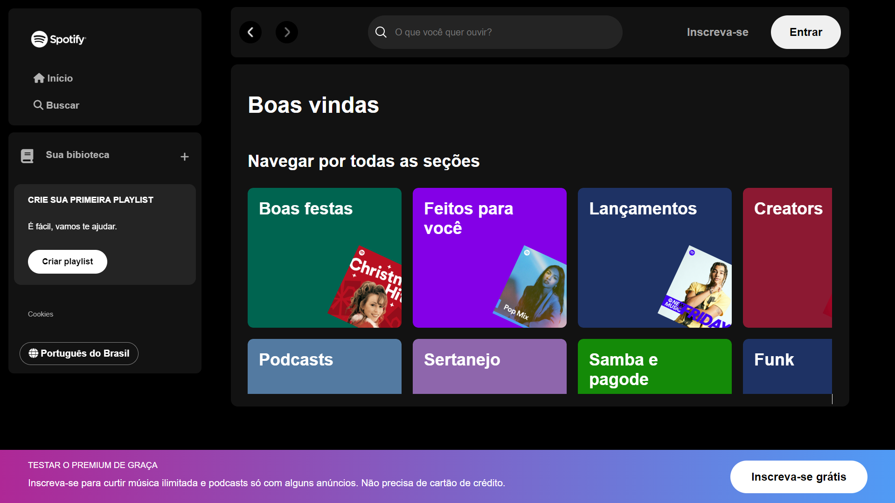
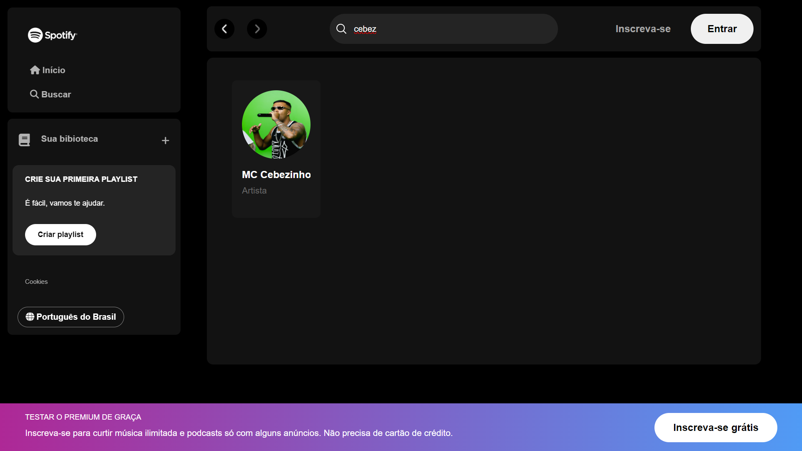

## 🎧 Spotify Clone

### 🚀 Tecnologias Usadas

[](https://skillicons.dev)


### 🔗 Sobre o projeto

Este projeto tem como objetivo replicar a interface do Spotify, proporcionando um desafio na aplicação dos meus conhecimentos em integração entre frontend e backend. Durante o desenvolvimento, priorizei a organização do código, a adoção de padrões de commits e o gerenciamento de branches com merges estratégicos.

No backend, implementei um endpoint `GET` que retorna dados de uma API fake armazenada no arquivo `artists.json`. Esse arquivo contém uma lista de artistas dos gêneros Rap e Funk, que são alguns dos meus favoritos.

Cada artista é representado como um objeto JSON com a seguinte estrutura:
   ```sh
   [
    {
    "id": 1,
    "name": "Racionais MC's",
    "genre": "Hip Hop",
    "urlImg": "https://i.scdn.co/image/ab6761610000e5eb43a0d1ae0af71095fcb26726"
    },
    {
    "id": 2,
    "name": "MC Cebezinho",
    "genre": "Funk",
    "urlImg": "https://i.scdn.co/image/ab6761610000e5eb6cdab9738cc51dd200082c5d"
    }
   ]
   ```


### 📂 Como Rodar o Projeto

🔹 Clonando o Repositório
   ```sh
   git clone https://github.com/lucasherrerods/spotify-page
   ```
🔹 Rodando o Backend
   ```sh
   cd backend
   npm install #instala as dependências
   node api.js #inicia o servidor na porta 3000
   ```
🔹 Rodando o Frontend
  <ul>
    <li>Opção 1: Abra o arquivo index.html diretamente no navegador.</li>
    <li>Opção 2: Utilize uma extensão como Live Server no VSCode para facilitar a visualização do projeto.</li>
  </ul>


### Exemplo do Projeto

<div align="center">
    
   <br><br>
    
</div>
